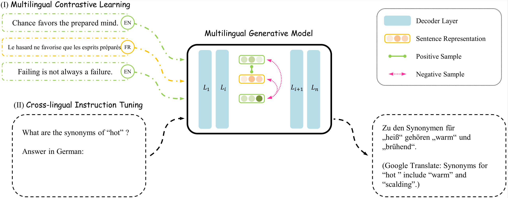

# Improving In-context Learning of Multilingual Generative Language Models with Cross-lingual Alignment

The code for the NAACL 2024 main conference paper "**Improving In-context Learning of Multilingual Generative Language Models with Cross-lingual Alignment**".

## Overview
To bridge the gap between languages in the multilingual generative models, we propose a simple yet effective cross-lingual alignment framework, named **A**lign a**F**ter **P**retraining(**AFP**), exploiting pairs of translation sentences. It aligns the internal sentence representations across different languages via multilingual contrastive learning and aligns outputs by following cross-lingual instructions in the target language. The following figure illustrates the modules of AFP:



## How to run?

### Set up an virtual environment
```
conda create -n afp python=3.9
conda activate afp
pip install -r requirements.txt
```

### Prepare cross-lingual instruction following data

1. Download multilingual instruction data, e.g., Bactrian-X from HuggingFace.
```
git clone https://huggingface.co/datasets/MBZUAI/Bactrian-X.git 
cd Bactrian-X/data
gzip -d *.gz
```

2. Generate cross-lingual instruction following data.
```
# Replace this path with your local path of CrossLingualAlignment, e.g., "/home/ubuntu".

export MY_PATH="PATH2CrossLingualAlignment"

# Generate cross-lingual instruction following samples.
# Output file: "$MY_PATH/CrossLingualAlignment/data/AFP.en_zh.X0.5.R3.0.json"
python src/generate_sup_data.py \
  --mode bilingual \
  --languages "en" "zh" \
  --cross-probability 0.5 \
  --repeat 3 \
  --bactrian-dir $MY_PATH/CrossLingualAlignment/Bactrian-X/data \
  --output-dir $MY_PATH/CrossLingualAlignment/data

#(Optional) Generate translation samples and merge files.

python src/generate_sup_data.py \
  --mode translation \
  --languages "en" "zh" \
  --change-probability 0.5 \
  --repeat 3 \
  --translation-file $MY_PATH/CrossLingualAlignment/data/opus.en2zh.tsv \
  --bactrian-dir $MY_PATH/CrossLingualAlignment/Bactrian-X/data \
  --output-dir $MY_PATH/CrossLingualAlignment/data

cat $MY_PATH/CrossLingualAlignment/data/AFP.en_zh.X0.5.R3.0.json $MY_PATH/CrossLingualAlignment/data/AFP.en-zh-trans.C0.5.R3.0.json | shuf >$MY_PATH/AFP.en_zh.train.json
```

### Train using AFP

```
cd script
# Set up your private parameters, e.g., the path of source model and evaluation tasks
vim run_sup_example.sh
bash run_sup_example.sh
```

## Time and Memory cost
We provide some data points of time and memory cost during training using bf16 and tf32:

| **Device** | **Model** | **Batch size/Device** | **Sequence length** | **Data Parallel** |  **Speed**  | **Max GPU memory allocated** |
|:----------:|:---------:|:---------------------:|:-------------------:|:-----------------:|:-----------:|:----------------------------:|
|   1*A800   | xglm-564m |           4           |         512         |         -         | 7.55 step/s |            33269MB           |
|   1*A800   | xglm-564m |           4           |         1024        |         -         | 6.54 step/s |            51511MB           |
|   2*A800   | xglm-564m |           8           |         1024        |   zero2 offload   | 1.62 step/s |            78785MB           |
|   4*A800   | xglm-7.5b |           1           |         1024        |   zero2 offload   | 4.58 s/step |            73957MB           |
|   8*A800   | xglm-7.5b |           2           |         512         |   zero2 offload   | 5.36 s/step |            72509MB           |
|   8*A800   | xglm-7.5b |           1           |         1024        |   zero2 offload   | 4.81 s/step |            73677MB           |

## Acknowledgment

We develop our code based on [SimCSE](https://github.com/princeton-nlp/SimCSE) and thank the efforts of Gao et al.!

## How to cite our paper?
```
@inproceedings{li-etal-2024-improving,
  author    = {Chong Li and
               Shaonan Wang and
               Jiajun Zhang and
               Chengqing Zong},
  title = "Improving In-context Learning of Multilingual Generative Language Models with Cross-lingual Alignment",
  booktitle = "Proceedings of the 2024 Conference of the North American Chapter of the Association for Computational Linguistics: Human Language Technologies",
  year = "2024",
  address = "Mexico City, Mexico",
  publisher = "Association for Computational Linguistics",
}
```